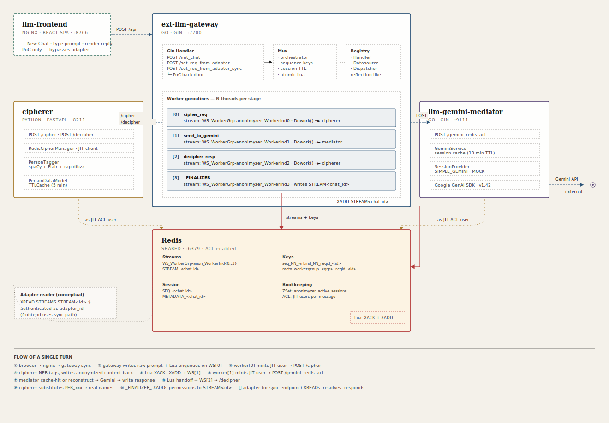

# LLM Anonymizer Suite — System Overview

> **What this is:** a four-service, Redis-backed pipeline that sits between a user-facing frontend and Google Gemini. Its job is to strip personal names out of prompts before they hit the LLM, let the LLM answer using opaque tokens in place of those names, then put the real names back into the response on the way out — without any single component ever holding both the plaintext identities and the LLM's view of them at the same time.

This repository is a **monorepo of four independently deployable services** plus a minimal test UI. Each service has its own dedicated README with the deep technical walkthrough; this document ties them together into one coherent picture.

---

## Table of Contents

1. [The four services at a glance](#1-the-four-services-at-a-glance)
2. [Core concepts (six you need to know)](#2-core-concepts-six-you-need-to-know)
3. [Architectural diagram](#3-architectural-diagram)
4. [End-to-end flow of a single turn](#4-end-to-end-flow-of-a-single-turn)
5. [Why it's built this way](#5-why-its-built-this-way)
6. [What's **not** shipped — gaps & roadmap](#6-whats-not-shipped--gaps--roadmap)
7. [The individual READMEs](#7-the-individual-readmes)
8. [Local setup guide](#8-local-setup-guide)
9. [How to verify it's working end-to-end](#9-how-to-verify-its-working-end-to-end)
10. [Troubleshooting](#10-troubleshooting)

---

## 1. The four services at a glance

| Service                    | Language | Port   | Role                                                                                     | README |
|----------------------------|----------|--------|------------------------------------------------------------------------------------------|--------|
| **`ext-llm-gateway`**      | Go       | `7700` | The orchestrator. Owns the Redis Streams pipeline, mints JIT ACL users, dispatches work to the other services via configurable worker stages. | `README.md` |
| **`cipherer`**             | Python   | `8211` | The cipher/decipher dispatcher. NER-tags person names, replaces them with opaque tokens, persists the per-chat mapping. | `cipherer_README.md` |
| **`llm-gemini-mediator`**  | Go       | `9111` | The LLM dispatcher. Owns Gemini chat sessions, handles history reconstruction on cache miss. | `mediator_README.md` |
| **`llm-frontend`**         | React + Nginx | `8766` | A throwaway test UI. Bypasses the adapter layer via the gateway's unauthenticated sync endpoint. | `frontend_README.md` |

Plus one shared infrastructure piece:

- **Redis** (port `6379`) — runs in its own container (`my-redis2` in the dev scripts). Provides both the orchestration substrate (streams, ZSets, Lua scripts for atomic ops) and the content datasource (per-stage keys scoped by per-message JIT ACL users).

> **One gateway instance serves exactly one kind of workload.** The shipped config runs an anonymized-chat pipeline; a document-summarization, translation, or RAG pipeline each run as a *separate* gateway deployment with its own `config.json`. See §2.2 for the reasoning — this is a deliberate design choice, not a limitation.

---

## 2. Core concepts (six you need to know)

### 2.1 The gateway is a *generic* pipeline orchestrator

The gateway doesn't know about anonymization. It knows about **worker stages** that each do some work on a message and pass it along. The shipped `config.json` happens to configure a cipher → LLM → decipher → finalizer chain because that's what this suite is for, but the gateway's code would work equally well for a moderation → translation → summarization chain, or anything else you describe in config.

Stages are pluggable via a **registry pattern**: a name in `config.json` resolves to a constructor in `registry/registry.go`, which returns an instance of an interface (`Handler`, `Datasource`, or `Dowork`). Adding a new stage doesn't modify any existing file.

### 2.2 One gateway instance = one worker group

This is the single most important deployment constraint to understand, and it is **deliberate**, not a limitation waiting to be removed.

**A gateway binary loads exactly one `workergroup` block from `config.json`** — the root config schema (`models.LlmExtGwConfig`) has a single `WorkerGroup` field, not a slice, and `main.go` passes that one block through to the orchestrator, the handler, and each worker it spawns. The stream-naming template (`WS_WorkerGrp-<group>_WorkerInd<N>`), the active-sessions ZSet key (`<group>_active_sessions`), the sequence key prefix, and the JIT ACL user naming are all parameterized on that one group name. There is no runtime mechanism for dispatching an inbound request to a *different* worker group inside the same process.

**The architectural intent is horizontal fan-out across gateway instances**, not vertical multiplexing inside one. Each gateway instance serves **one kind of LLM workload end-to-end**, and different workloads run as different gateway deployments. For example:

| Deployment                  | Worker group config                                                    | Typical workload                                        |
|-----------------------------|-----------------------------------------------------------------------|---------------------------------------------------------|
| `ext-llm-gateway-anon`      | `cipher_req` → `send_to_gemini` → `decipher_resp` → `_FINALIZER_`      | Anonymized chat (the shipped example).                  |
| `ext-llm-gateway-summarize` | `chunker` → `map_summarize` → `reduce_summarize` → `_FINALIZER_`       | One-shot document summarization of uploaded files.      |
| `ext-llm-gateway-moderate`  | `classify` → `policy_check` → `redact` → `send_to_gemini` → `_FINALIZER_` | Content moderation with LLM-assisted review.         |
| `ext-llm-gateway-translate` | `detect_lang` → `send_to_gemini` → `quality_check` → `_FINALIZER_`    | Translation workflows.                                  |
| `ext-llm-gateway-rag`       | `retrieve` → `rerank` → `compose_prompt` → `send_to_gemini` → `cite` → `_FINALIZER_` | Retrieval-augmented generation.              |

Each of these is a **separate `docker run`** of the same gateway binary with a different `config.json` mounted. They all share one Redis cluster (and each gets its own namespace inside it because the group name parameterizes every key). The upstream adapters know which gateway to route a request to based on client type / use case / tenant plan — that routing decision belongs in the adapter tier, not in the gateway.

**Why this design:**

- **Workload isolation.** A long-running heavy-attachment summarization job cannot starve the interactive anonymized-chat pipeline. Different deployments = different pods = different resource budgets.
- **Independent scaling.** The translation deployment may need 20 pods, the RAG deployment 4, the anonymizer 8. Each scales on its own signal.
- **Independent release cadence.** Updating the moderation chain doesn't require redeploying the anonymizer.
- **Independent configs for the same infrastructure.** Different retry counts, different timeouts, different LLM backends, different session TTLs — each group tunes to its workload.
- **Simpler code.** The gateway's internal state machine (sequence keys, active sessions ZSet, stream naming) was trivially simple to reason about because it only ever has one group to worry about. Adding multi-group support inside one process would multiply every piece of state by an N-dimensional group-ID axis and invite a whole class of cross-group isolation bugs.

**Implication for the `workergroup` field name in config:** it looks like it should be plural-able but it isn't. Treat it as the single "what does this gateway instance do" declaration. Changing this to a slice is a non-trivial refactor that would touch the orchestrator, every key template, and every log line; if you need multiple workloads, run multiple gateways instead — it's the cheaper and more correct fix.

### 2.3 JIT (Just-In-Time) Redis ACL users

No service in this system holds a long-lived Redis credential. Instead, for every single message flowing through every single worker stage, the gateway:

1. Creates a brand-new Redis ACL user (`ACL SETUSER ...`) scoped to exactly the keys that stage needs to read and write.
2. Passes those credentials to the downstream service (cipherer or mediator) in the request body.
3. Lets the downstream service connect to Redis as that user, read/write what it needs, and discard the connection.
4. Eventually destroys the user when the chat session expires (`ACL DELUSER` + `CLIENT KILL USER`).

The blast radius of a compromised dispatcher is limited to whichever chats have active credentials at that moment — not the whole datasource.

### 2.4 Redis Streams as the pipeline substrate

Every worker stage owns a Redis stream (`WS_WorkerGrp-anonimyzer_WorkerInd<N>`). Messages flow from one stream to the next via an atomic Lua script that combines `XACK` + `XDEL` + `XADD` in one round-trip. This gives the pipeline:

- **At-least-once delivery** — a crashed worker's unacked messages are reclaimed by `XAUTOCLAIM` on another pod.
- **Horizontal scale** — any pod can handle any message.
- **Self-healing** — messages pending longer than their configured TTL are hard-dropped with an error notification to the adapter stream.
- **No message loss across atomic handoffs** — you can never ACK without publishing, or publish without ACKing.

### 2.5 The adapter layer (conceptual, not shipped)

The gateway's authentication surface is an `adapter_id` allow-list. That's it — everything else (end-user authentication, OIDC, rate limiting, tenant isolation, abuse protection) is assumed to live in a **separate adapter service** that sits between any front-end and this gateway.

That adapter service is **not part of this repo**. The shipped `llm-frontend` is a test shortcut that bypasses it entirely via the gateway's unauthenticated `/set_req_from_adapter_sync` endpoint, documented explicitly as PoC-only. In a real deployment you write your own adapter, or you put an authenticating proxy (Envoy, Kong, etc.) in front of the gateway.

### 2.6 Stateless dispatchers with smart caches

Both the cipherer and the mediator are stateless at the process boundary — any pod can handle any request. But both have in-process TTL caches (`cachetools.TTLCache` in Python, `patrickmn/go-cache` in Go) that amortize the per-turn cost of reloading expensive state:

- **Cipherer** caches the `PersonDataModel` (the forward/reverse name-to-token maps) per chat.
- **Mediator** caches live `*genai.Chat` sessions per chat.

On cache miss, both services **reconstruct from Redis** — the cipherer re-parses the meta map, the mediator replays prior turns into a fresh Gemini chat. The caches are optimizations, not durability layers.

---

## 3. Architectural diagram



---

## 4. End-to-end flow of a single turn

Using the shipped configuration, here is what happens between a user pressing Enter in the frontend and seeing the deciphered reply:

1. **Browser → frontend** — React's `sendMessage` POSTs `/api/set_req_from_adapter_sync` with `{internal_chat_id, request_key, content}`.
2. **Nginx → gateway** — the `/api/` Nginx location reverse-proxies to `http://host.docker.internal:7700/set_req_from_adapter_sync`. Timeout is set to 6000s because the sync path blocks for the full pipeline.
3. **Gateway handler** — validates the request, checks `request_key` matches `SEQ_<chat_id>`, writes the raw prompt to Redis at `seq_00_...wrkind_00_reqid_<chat_id>`, atomically bumps `SEQ_` and `XADD`s the message onto the `cipher_req` worker's stream.
4. **Gateway worker (cipher_req)** — `XREADGROUP`s the message, mints a JIT Redis user scoped to just the keys cipherer needs, POSTs `ReqRedisAccessPermissions` to `cipherer:/cipher` with header `X-User-ID: <chat_id>`.
5. **Cipherer** — connects to Redis as the JIT user, reads the raw prompt, runs spaCy + Flair NER, replaces person names with `PER_<hash>` tokens, writes the anonymized text back to `seq_00_...wrkind_01_...`, persists the updated `PersonDataModel` to the meta key. Returns HTTP 200.
6. **Gateway worker (cipher_req)** — on 200, Lua-atomically `XACK`s its stream and `XADD`s to `send_to_gemini`'s stream.
7. **Gateway worker (send_to_gemini)** — mints a fresh JIT user whose read keys are *interleaved* (current prompt + all prior user prompts + all prior model responses), POSTs to `mediator:/gemini_redis_acl`.
8. **Mediator** — looks up `<chat_id>` in its session cache. Hit → use cached `*genai.Chat`. Miss → call `GeminiProvider.CreateSession`, which if there's history replays all prior turns into a new Gemini chat. Sends the current prompt, splits response parts into `InputText` vs `Explanations` (chain-of-thought), writes the response JSON to the write key. Returns HTTP 200.
9. **Gateway worker (send_to_gemini → decipher_resp)** — Lua handoff to the decipher stage's stream.
10. **Gateway worker (decipher_resp)** — mints a JIT user, POSTs to `cipherer:/decipher`.
11. **Cipherer** — connects as the JIT user, reads the Gemini response, uses the per-chat `chat_decipher` map to regex-substitute every `PER_xxx` token back to the original name, writes deciphered text to the next key. Returns HTTP 200.
12. **Gateway worker (decipher_resp → _FINALIZER_)** — Lua handoff.
13. **Gateway worker (_FINALIZER_)** — mints a read-only JIT user for the final deciphered key and `XADD`s a message to `STREAM_<chat_id>` containing those credentials.
14. **Gateway sync handler** — blocked since step 3 on `XREAD STREAMS STREAM_<chat_id> $`, unblocks, uses the credentials to `GET` the final content, returns it in the HTTP response to Nginx.
15. **Browser** — React renders `data.content.input_text` as the assistant's reply, updates `nextKey` from `data.set_next_req_key`, awaits the next turn.

Total steps: 15. Total latency: typically 2–10 seconds, dominated by Gemini. Total state held outside Redis: the mediator's in-process `*genai.Chat` object and the cipherer's in-process `PersonDataModel` (both rebuildable from Redis on miss).

---

## 5. Why it's built this way

Five design pillars, each documented more deeply in its service's README:

1. **Separation of concerns across process boundaries.** The gateway doesn't know how NER works. The cipherer doesn't know what model Gemini is using. The mediator doesn't know the original names. No single component has the full picture.
2. **Pluggability everywhere.** Every axis of variation (inbound protocol, datasource, worker stage logic, LLM backend) is behind a named-registry factory. Swapping Redis for Postgres, Gemini for Claude, or HTTP for gRPC touches *only* the affected module.
3. **Stateless where possible, cached where valuable.** Durable state (the conversation, the person map, the sequence key) lives in Redis. Expensive-to-rebuild state (live Gemini chats, parsed `PersonDataModel`) lives in in-process TTL caches that self-heal on miss.
4. **JIT-scoped credentials per message.** No long-lived Redis passwords in any dispatcher. Blast radius of any compromise is bounded.
5. **At-least-once delivery with atomic handoffs.** Lua scripts make ACK+publish uninterruptible. Stuck messages are reclaimed; truly-stuck messages are buried with an error notification to the adapter.

---

## 6. What's *not* shipped — gaps & roadmap

This repo is a **working vertical slice**, not a finished product. Several capabilities necessary for a real deployment are either partially scaffolded or entirely absent. This section enumerates them, groups them by the service that should own each one, and — where the gap is a pipeline stage — suggests it be implemented as a new **dispatcher** in the gateway's registry (which is exactly the extension mechanism the registry pattern was designed for).

### 6.1 Gaps in `ext-llm-gateway`

**Attachments pipeline is scaffolded but not wired.** `models.Content` already has `InlineDatas []InlineData` and `FileDatas []FileData` fields with `omitempty` tags (and comments marking them *"For future use — TBD"*), and `InitChatRequest.PersistanceTimeSeconds` can be set per-chat to keep large blobs alive longer. What's missing is: (a) payload-aware size checks beyond the single `ValRedisMaxSizeByte` (images/docs need their own caps), (b) a content-store alternative to Redis for anything above a few MB (S3/MinIO with presigned URLs referenced from the content), and (c) the per-dispatcher logic to pass those references downstream. Treat this as a gateway-side datasource extension plus a cipherer-side (and mediator-side) MIME-aware branch.

**No real adapter layer.** The gateway's authentication surface is a static `adapter_id` allow-list in `handler.adapters`. There is no adapter service shipped — see §6.5 below.

**No budget / quota enforcement at the edge.** Oversized *prompts* are rejected; oversized *conversations* (many turns, huge prior context) and oversized *bills* (token count × price × tenant) are not. See §6.6 for the suggested dispatcher.

**`Datasource` interface has placeholder methods.** `GetLastNContents`, `SetContentMeta`, `GetContentMeta` in `registry/datasource/redis.go` currently return `true, "PLACEHOLDER"` — an intentional extension seam the author marked for later. Anything that wants history-aware decisions (budget, rate limiting, caching, analytics) will need these implemented.

**Finalizer is single-purpose.** `_FINALIZER_` only writes the JIT-access payload back to `STREAM_<chat_id>`. A production finalizer may want to additionally: emit metrics, write to an audit log, trigger webhooks, or kick off a background summarization job. All of these are straightforward new dispatchers that could either replace `_FINALIZER_` or be chained after it.

### 6.2 Gaps in `cipherer`

**Anonymizes *only* person names — nothing else.** The shipped `PersonTagger` detects `PERSON` entities via spaCy + Flair and ignores `ORG`, `LOC`, `GPE`, `DATE`, `PRODUCT`, phone numbers, emails, credit cards, medical record numbers, IP addresses, URLs with embedded identifiers, employee IDs, and every other class of personally identifiable data. This is the single most important gap in the suite — a prompt like *"John Carter's credit card ending in 4242 expires 03/2028 and his NYC zip is 10014"* would reach the LLM with only "John Carter" ciphered.

The fix is additive — new taggers register into the existing dispatch plumbing. Recommended additions, in roughly priority order:

- **Credit cards** — regex + Luhn validation. Token prefix `CC_`.
- **Emails** — email regex with a small set of safe-domain allowlists. Token prefix `EM_`.
- **Phone numbers** — `phonenumbers` library. Token prefix `PH_`.
- **Medical record numbers, social security numbers, EINs, tax IDs** — jurisdiction-specific regex families. Token prefixes `MRN_`, `SSN_`, etc.
- **Addresses, cities, zip codes** — reuse Flair's `LOC`/`GPE` spans (already detected, currently only used to *suppress* false-positive person matches — they should independently become cipher candidates).
- **Dates of birth / sensitive dates** — spaCy's `DATE` entity, filtered by heuristic (4-digit year looks like a DOB when combined with nearby person mentions).

Each of these lives as a new class in `app/cipher_text/`, composed behind a single "router" tagger that fans out to all enabled sub-taggers and merges their replacement offsets. The `PersonDataModel.chat_decipher` dict can host all entity types side-by-side because the token prefixes don't collide.

**Contextual re-identification risk — suggested: `synthetic_data` dispatcher.** Even if every PII token is replaced, an LLM can re-identify a person from context alone: *"the Acme Corp engineer in Zurich who filed the patent on X in March 2023"* uniquely identifies someone without any PER/EMAIL/PHONE token appearing. The suggested fix is a **new dispatcher** inserted between cipher and LLM:

- **Name:** `SYNTH_DATA` (new `Dowork` in `registry/dispatchers/`).
- **Role:** after cipher has run, before the LLM sees the prompt, replace contextually-sensitive details with plausible synthetic substitutes drawn from controlled vocabularies — employer names (`Acme Corp` → `Industrial Widgets Inc.`), locations (`Zurich` → `Frankfurt`), specific dates (`March 2023` → `Q1 2023`), product names, patent numbers, etc.
- **Mechanism:** a persistent per-chat `synthetic_map` stored alongside `PersonDataModel`, so "Acme Corp" maps to the same synthetic replacement on every turn of a conversation but a different one across chats. Reversible on the way back out (same mechanism as person cipher — a decipher sibling).
- **Trade-off:** the LLM may give slightly less accurate answers when the context has been neutralized. Worth it for privacy-sensitive deployments; toggle via config.

**Cipherer is English-only.** `spacy.load("en_core_web_trf")` and `SequenceTagger.load("ner")` are both English models. The `_get_word_combinations` alias generator assumes western name shape (given + family, with optional middle). Multilingual deployments need a provider-like abstraction at the tagger level — swap `PersonTagger` for `MultilingualPersonTagger` via a registry entry parallel to the mediator's provider registry.

**No audit trail of what was ciphered.** The `PersonDataModel` is kept for reversibility but there is no separate append-only log of "which PII spans were detected, what confidence, what token replaced them." Useful for compliance reviews, false-positive/negative debugging, and regulatory evidence. Easy addition — write a JSON line to a log key per request.

### 6.3 Gaps in `llm-gemini-mediator`

**Only one provider actually ships:** `SIMPLE_GEMINI` (plus a `MOCK`). Alternative providers (OpenAI-compatible, Anthropic, local Llama, Bedrock) are described in the mediator README as one-file extensions but are not implemented.

**The `Messenger` interface is Gemini-shaped.** `SendMessage(ctx, ...genai.Part) (*genai.GenerateContentResponse, error)` leaks Google-SDK types. A provider-neutral `v2` interface with our own `Part` and `Response` types should land before the second real provider, otherwise every new provider pays a translation-adapter tax.

**No streaming response support.** `GenerateContent` is called synchronously and the full response is written to Redis in one `SET`. Streaming (via `GenerateContentStream` on Gemini's side, SSE from adapter to front-end) would cut perceived latency dramatically for long responses but requires partial-write handling in the gateway's pipeline and — crucially — streaming decipher.

**Token budget / cost visibility is missing.** Every turn calls Gemini with potentially large history (reconstructed on cache miss) and no telemetry is emitted about token counts, estimated cost, or cumulative chat spend. See §6.6 for the suggested dispatcher solution.

**Suggested: `TOKEN_REDUCER` dispatcher.** A new `Dowork` placed between cipher and the LLM, whose job is to keep the prompt under a configurable token ceiling:

- **Location:** new worker stage in `config.json`, new dispatcher in `registry/dispatchers/`.
- **Strategy:** (a) rolling summarization — on every Nth turn, summarize the oldest M turns into a compact system-context blurb and drop the originals; (b) semantic trimming — embed the current prompt, rank prior turns by cosine similarity to it, keep the top-K; (c) hard truncation with a notice. Pick per-chat via config.
- **Why a separate stage and not inside the mediator:** keeps the LLM dispatcher dumb. Swapping the reduction strategy, or A/B-testing two, is a config change — no mediator rebuild. Also applies uniformly to every future LLM backend.

### 6.4 Gaps in `llm-frontend`

The frontend is explicitly PoC-only, so "gaps" is mostly "everything a real frontend has." The relevant ones:

- **No authentication whatsoever.** See §6.5.
- **No history view** — messages live only in `useState`; refresh loses them. A real UI would sync chat history from the adapter.
- **No streaming.** UI blocks on the sync endpoint for the full round-trip; a spinner would be nice, SSE would be better.
- **No attachment support** — no file picker, no paste-image handling. Ties to §6.1.
- **Hard-coded `user_id` and `adapter_id`.** `"sss@ff.com"` and `"ada1"` are literal strings in `App.jsx`. A real UI gets these from the authenticated session.

Replacing it is preferable to extending it.

### 6.5 Missing service — **the adapter(s)**

The single biggest structural gap. The gateway's architecture *requires* an adapter service between any end-user surface and the gateway, to handle authN/authZ/rate-limits/tenant isolation/stream-reader multiplexing — but **no such service is shipped**. You need at least one, probably several, because different client types have fundamentally different shapes:

| Client shape                                 | Adapter characteristics                                                                                    |
|----------------------------------------------|------------------------------------------------------------------------------------------------------------|
| **Interactive web UI, short turns**          | Holds an open WebSocket or SSE per user session; relays prompts to gateway async endpoint; reads `STREAM_<chat_id>` on behalf of the user; streams tokens back. Authentication via OIDC/cookie session. Rate limit per user per minute. |
| **CLI / terminal clients**                   | Thin adapter with API key auth. Short-lived HTTP calls that can use the sync path (the cost of a mid-latency sync response is acceptable in a CLI). Pre-authorized per API key. |
| **Email ingestion / async bots**             | Long-polling or batch-scheduled. Queue-backed: adapter reads IMAP / SQS / Kafka, submits each message as a chat turn, stores `chat_id`, polls `STREAM_<chat_id>` with large timeout, emits the reply back into the source channel (reply email, Slack DM, etc.). Heavy-tolerant. |
| **One-shot "heavy" analyses**                | Document-summarization-style workloads: adapter accepts a large attachment, splits it, opens a chat, streams chunks in, collects the finalizer output(s), reassembles. Long-running job semantics, not chat semantics. Persistent job state in the adapter's own DB. |
| **Scheduled / programmatic agents**          | Long-lived chat pinned across workflow steps. Adapter manages the chat lifecycle across days. Needs explicit session resumption UX, not just TTL expiry. |

Each of these is a genuinely different service, even though they all speak the gateway's two-endpoint API. Trying to build "one adapter to rule them all" is an architectural mistake — build small and build several.

Minimum features any adapter must provide:

1. **End-user authentication** (OIDC, API keys, mTLS — whatever the channel demands).
2. **Authorization** to an `adapter_id` that the gateway recognizes; never pass end-user identity through to the gateway's allow-list.
3. **Rate limiting** per end-user, per tenant, per API key.
4. **Stream-reader ownership** — maintain the `XREAD STREAMS STREAM_<chat_id>` loop so end-users never need Redis credentials.
5. **Credential custody** — the `stream_pwd` returned by `/init_chat` stays inside the adapter.
6. **Audit logging** of every end-user request, mapped back to an internal `chat_id`.

Once you have adapters, the gateway's `/set_req_from_adapter_sync` PoC back door should be **turned off at build time** (behind a `DEV_MODE=1` build tag) and the `llm-frontend` container should be deleted.

### 6.6 Suggested: `BUDGET_GUARD` dispatcher

A new worker stage inserted **after** the mediator (so it sees real post-LLM token counts) and **before** the finalizer:

- **Location:** new `Dowork` in `registry/dispatchers/`, configured as an additional worker in `config.json` between `decipher_resp` and `_FINALIZER_`.
- **Inputs:** the LLM's raw response (with its token counts — Gemini returns them in `resp.UsageMetadata`), the `chat_id`, a per-tenant budget config (daily spend cap, per-chat token cap, burst policy).
- **Actions:**
  - Compute cost = `prompt_tokens × price_prompt + completion_tokens × price_completion` for the model used.
  - Increment a per-tenant counter in Redis (`budget:<tenant>:day:<YYYYMMDD>`) atomically via Lua.
  - If over cap: replace the content with a `_BUDGET_EXCEEDED_` error, short-circuit the pipeline (pattern matches the gateway's `DelOldNAckFromStream` notification mechanism), and write a metric.
  - If within cap: pass the message through untouched.
- **Why a separate stage:** budgets change often (per-tenant, per-plan, per-promo). Keeping this logic in its own tiny dispatcher means policy changes don't touch the mediator, don't touch cipher, and don't touch the finalizer. This also cleanly pairs with the `TOKEN_REDUCER` stage suggested in §6.3 — `TOKEN_REDUCER` *prevents* overruns preemptively; `BUDGET_GUARD` *enforces* them post-hoc.

### 6.7 Cross-cutting gaps

- **No metrics / tracing.** No Prometheus metrics, no OpenTelemetry spans. Every service has its own logger; there is no correlation ID threaded through the pipeline. `chat_id` is effectively the correlation ID today (it's already in every log line and every stream message) — adding OTEL with `chat_id` as the trace attribute would be a one-day job per service.
- **No CI / no shipped test harness** — the legacy Go tests don't exercise current code paths. A docker-compose-based e2e harness that stands up all four services + a miniredis fixture + a Gemini mock and runs the prompt pairs in `tests/restapi/` would close this.
- **No graceful shutdown.** All three Go services use `select {}` or `r.Run()` and rely on Docker SIGTERM to hard-kill. Mid-flight messages survive because of the stream reclaim logic, but a clean drain would reduce the retry noise on deploy.
- **Secret management is file-based.** The gateway's password comes from a file path in an env var. Works everywhere, but Kubernetes ExternalSecrets / HashiCorp Vault integrations would be a friendlier story for production.

---

## 7. The individual READMEs

For the deep dive on each component, see:

- **[`Gateway README.md`](./ext-llm-gateway/README.md)** (gateway) — the orchestrator, streams, Lua scripts, JIT ACL management, registry pattern, session cleanup. ~870 lines.
- **[`Cipherer README.md`](./ext-llm-cipher/README.md)** — the NER pipeline (spaCy + Flair), the `PersonDataModel`, fuzzy matching, alias expansion, regex substitution. ~670 lines.
- **[`Gemini Mediator README.md`](./llm-gemini-mediator/README.md)** — Gemini session management, history reconstruction, the provider registry, thought-part separation. ~780 lines.
- **[`Simple Frontend README.md`](./ext-llm-frontend/README.md)** — the test UI and its explicit PoC-only status. ~85 lines.

Each of those files is self-contained — you can read just one if you're only working on that service.

---

## 8. Local setup guide

This guide gets all four services running on a single Docker host (Docker Desktop on macOS/Windows, or native Docker on Linux). It assumes you have Docker installed and a clone of this monorepo at `~/llm-anonymizer-suite/` containing the four subdirectories.

### 8.1 Prerequisites

- Docker (any recent version with `host.docker.internal` support; on Linux add `--add-host=host.docker.internal:host-gateway` to `docker run` if needed).
- A Google AI Studio API key for Gemini ([aistudio.google.com](https://aistudio.google.com)) — grab a free-tier key if you don't have one.
- About 4 GB of free memory (the cipherer's spaCy + Flair models take ~2 GB).
- Ports `6379`, `7700`, `8211`, `8766`, and `9111` free on your host.

### 8.2 Start Redis first

Every other service depends on Redis being reachable at hostname `redis` (via `--link`).

```bash
docker run -d \
  -p 6379:6379 \
  --name my-redis2 \
  redis:7.4 \
  redis-server --requirepass mysecret
```

Verify:

```bash
docker exec -it my-redis2 redis-cli -a mysecret PING
# PONG
```

### 8.3 Create the Redis secret file the gateway expects

The gateway reads its Redis password from a file pointed to by an env var. Create it:

```bash
mkdir -p ~/llm-anonymizer-suite/secrets
echo -n "mysecret" > ~/llm-anonymizer-suite/secrets/redis_secret
```
You will need the secrets file **only** when the service is delivered to prod, when testing locally executing `restart_session_nmg.sh` is enough.

### 8.4 Start the gateway

From the parent directory ext-llm-gateway executes `restart_session_mng.sh`

For non-local deployment you would need to change `docker run` command in the following manner: 

```bash
cd ~/llm-anonymizer-suite
docker stop ext-llm-gateway 2>/dev/null; docker rm ext-llm-gateway 2>/dev/null
docker build -t ext-llm-gateway -f ext-llm-gateway/Dockerfile .
docker run -d \
  --name ext-llm-gateway \
  --link my-redis2:redis \
  -v ~/llm-anonymizer-suite/secrets:/secrets:ro \
  -e REDIS_SECRET_FILE=/secrets/redis_secret \
  -e SYNCH_REDIS_SECRET_FILE=/secrets/redis_secret \
  -p 7700:7700 \
  ext-llm-gateway
```

Watch the logs for a successful startup:

```bash
docker logs -f ext-llm-gateway
# [INFO]: Starting SyncRedisDatasource..
# [INFO]: Connected to Redis redis:6379 with username default
# [INFO]: Starting RedisDatasource..
# [INFO]: Loading DispatcherProtocol=REDISACL_RESTAPI Workename=cipher_req ...
# [INFO]: Starting Gin RestAPIHandler...
```

### 8.5 Start the cipherer

Execute`restart_session_nmg.sh` when testing locally.

The first build pulls ~1 GB of models; subsequent builds are cached. Startup takes ~30 seconds while the models load.

### 8.6 Start the mediator

Export your Gemini API key and use the shipped `./llm-gemini-mediator/restart_session_mng.sh` (or the equivalent `docker run` command):

```bash
cd ~/llm-anonymizer-suite
export GEMINI_API_KEY="YOUR_KEY_HERE"
docker stop llm-gemini-mediator 2>/dev/null; docker rm llm-gemini-mediator 2>/dev/null
docker build --no-cache -t llm-gemini-mediator -f llm-gemini-mediator/Dockerfile .
docker run -d \
  --name llm-gemini-mediator \
  --link my-redis2:redis \
  -e GEMINI_MODEL="gemini-2.5-flash" \
  -e GEMINI_PROVIDER=SIMPLE_GEMINI \
  -e GEMINI_API_KEY="$GEMINI_API_KEY" \
  -p 9111:9111 \
  llm-gemini-mediator
```
If you wish to use the Gemini Mock simply execute `restart_session_mng_mock.sh`


Verify:

```bash
docker logs llm-gemini-mediator
# [INFO]: llm-gemini-mediator listening on :9111
```

### 8.7 Start the frontend

Build and run with `restart_session_mng.sh` 

### 8.8 Verify all four are up

```bash
docker ps --format "table {{.Names}}\t{{.Status}}\t{{.Ports}}"
# NAMES                 STATUS         PORTS
# llm-chat              Up X seconds   0.0.0.0:8766->8766/tcp
# llm-gemini-mediator   Up X seconds   0.0.0.0:9111->9111/tcp
# ext-llm-cipherer      Up X seconds   0.0.0.0:8211->8211/tcp
# ext-llm-gateway       Up X seconds   0.0.0.0:7700->7700/tcp
# my-redis2             Up X seconds   0.0.0.0:6379->6379/tcp
```

Open **http://localhost:8766/llmtest** in your browser. You should see the minimal ChatGPT-style UI.

---

## 9. How to verify it's working end-to-end

1. Click **+ New Chat**. The sidebar should show `ID: <first 8 chars>...`. Internally this triggered a `POST /init_chat` — check `docker logs ext-llm-gateway` to confirm a new UUID was generated and the adapter stream was created.
2. Type a prompt that includes a person's name — something like "Hi, I'm working with **John Carter** at **Acme Corp**'s New York office on a Datadog issue". Press Enter.
3. Watch the logs across all three backend services:
   - **Gateway**: `[DEBUG] Fetched msgid FromStream ...` (cipher_req), then again (send_to_gemini), then again (decipher_resp), then (_FINALIZER_).
   - **Cipherer**: `[DEBUG] /cipher was called...`, then later `[DEBUG] /decipher was called...`.
   - **Mediator**: `[INFO] Connecting to Redis: redis:6379`, `[DEBUG] sendToGemini for sessionId - ...`.
4. The reply should appear in the UI within 2–10 seconds. **The key test:** the reply should mention "John Carter" by name (proving decipher worked), *and* if you peek at Redis during the flow, the content at the send_to_gemini stage should contain `PER_xxx_SEQ01_POS...` tokens instead of "John Carter" (proving the LLM never saw the real name).
5. Send a follow-up turn: "Who did I just ask about?" The LLM should correctly recall "John Carter", proving the cipher map is persistent across turns and the mediator's session handling works.

### Peek at Redis mid-flow

```bash
docker exec -it my-redis2 redis-cli -a mysecret
> KEYS *
# METADATA_<chat_id>
# SEQ_<chat_id>
# seq_00_workergroup_anonimyzer_wrkind_00_reqid_<chat_id>
# seq_00_workergroup_anonimyzer_wrkind_01_reqid_<chat_id>
# seq_00_workergroup_anonimyzer_wrkind_02_reqid_<chat_id>
# seq_00_workergroup_anonimyzer_wrkind_03_reqid_<chat_id>
# meta_workergroup_anonimyzer_reqid_<chat_id>
# STREAM_<chat_id>
# WS_WorkerGrp-anonimyzer_WorkerInd0 (and 1, 2, 3)
# anonimyzer_active_sessions

> GET seq_00_workergroup_anonimyzer_wrkind_00_reqid_<chat_id>
# "{\"input_text\":\"Hi, I'm working with John Carter at Acme Corp's New York...\"}"

> GET seq_00_workergroup_anonimyzer_wrkind_01_reqid_<chat_id>
# "{\"input_text\":\"Hi, I'm working with PER_q9rBOL6Q0g4pfi4 at Acme Corp's New York...\"}"
# ^^^ Note: "John Carter" → PER_xxx, but "Acme Corp" is NOT ciphered (ORG detected by Flair)
```

---

## 10. Troubleshooting

| Symptom                                                        | Likely cause                                                       | Fix                                                                                   |
|----------------------------------------------------------------|--------------------------------------------------------------------|---------------------------------------------------------------------------------------|
| Gateway exits with `Failed to connect to Redis`               | Redis not up, or ACL password mismatch, or secret-file env var wrong | `docker logs my-redis2`; confirm the `users.acl` has `user default on >mysecret allkeys allcommands`; check the secret file path. |
| UI shows "Connection failed"                                   | Gateway not reachable from Nginx                                   | Ensure Nginx's `proxy_pass` `host.docker.internal:7700` resolves; on Linux add `--add-host=host.docker.internal:host-gateway` to the frontend container. |
| UI shows an error message with `was not initiated`             | The `chat_id` in UI state doesn't match a session in Redis         | Click **Clear Session**, then **+ New Chat**. (This happens if you restart the gateway while the UI still has a stale chat_id.) |
| Cipherer returns 500 `Read key not found`                      | JIT user doesn't have permission for the key, or the gateway wrote to a different key | Check the gateway's `[DEBUG] ACL for reqid ...` log line; verify the read key matches what the cipher_req worker wrote. |
| Mediator returns 500 with a Gemini auth error                  | Bad or missing `GEMINI_API_KEY`                                    | `docker exec llm-gemini-mediator env \| grep GEMINI`; regenerate key at AI Studio if needed. |
| Responses come back with `PER_xxx` tokens visible              | decipher_resp stage didn't run, or the cipher map wasn't loaded    | Check `docker logs cipherer` for a `/decipher was called...` line for your chat_id. |
| First turn works, second turn hangs or fails                   | `SEQ_<chat_id>` mismatch; the UI re-used the old `request_key`     | The UI should update `nextKey` from `data.set_next_req_key` on each success — check the browser's Network tab. |
| Mediator session cache miss causes "turn 2 forgets turn 1"    | History reconstruction didn't find the prior keys                  | Check that the gateway's `send_to_gemini` dispatcher is passing interleaved read keys with history > 1 for turn 2. |
| Gateway logs `Wrong sequance key`                              | The UI (or curl) sent a stale `request_key`                        | Same as above — always use the most recent `set_next_req_key` from the previous response. |

### Fully reset state

When in doubt:

```bash
docker exec -it my-redis2 redis-cli -a mysecret FLUSHALL
docker restart ext-llm-gateway ext-llm-cipherer llm-gemini-mediator
```

Then refresh the browser, click **Clear Session**, click **+ New Chat**.

---

*This meta-README was generated from the full source of all four services. For every claim made here, the corresponding service-specific README contains the deeper justification, the per-function walkthrough, and the extension worked-examples.*
